# Design Document: PYRAMID OS

## Overview

PYRAMID OS is a multi-agent Minecraft automation system that orchestrates AI-powered bots to build and operate an ancient Egyptian civilization. The system is built as a TypeScript pnpm monorepo running entirely locally on Windows, using Ollama for LLM inference and Mineflayer for Minecraft bot control.

The architecture follows a layered design:

1. **Orchestration Layer (OpenClaw)** — manages agent lifecycle, workspace isolation, inter-agent communication, and LLM routing
2. **Game Interface Layer (Minecraft Controller)** — translates agent commands into Mineflayer bot actions, handles connections, pathfinding, and bot health
3. **Planning Layer (Society Engine)** — coordinates tasks, resources, zones, build phases, and dependencies
4. **Data Layer** — SQLite for structured persistence, JSON snapshots for state export/import
5. **Presentation Layer (Control Centre)** — Egyptian-themed Canvas/A2UI dashboard with WebSocket real-time updates
6. **API Layer** — Fastify REST API + WebSocket for external integration and Control Centre communication
7. **CLI Layer** — command-line tooling for administration and diagnostics

### Key Design Decisions

| Decision | Choice | Rationale |
|---|---|---|
| Monorepo tool | pnpm workspaces | Native workspace support, fast installs, strict dependency isolation |
| LLM backend | Ollama (local only) | Privacy-first, no external API calls, supports gpt-oss:20b and qwen3 |
| Bot library | Mineflayer | Mature Node.js Minecraft bot library, active community |
| Database | SQLite (better-sqlite3) | Zero-config, single-file, excellent for local-first apps |
| API framework | Fastify | High performance, TypeScript-friendly, schema validation built-in |
| UI rendering | Canvas/A2UI | Lightweight, no heavy framework dependency, custom Egyptian theme |
| Runtime | Node.js 22+ | Latest LTS, native TypeScript support improvements |

## Architecture

### High-Level System Diagram

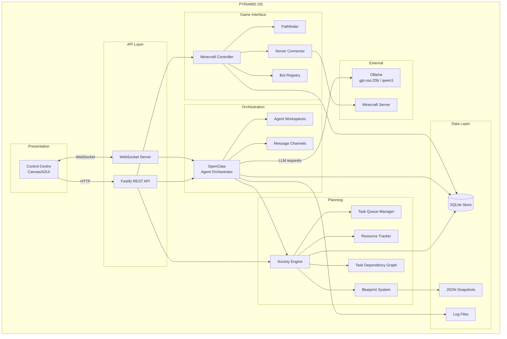

### Agent Hierarchy Diagram

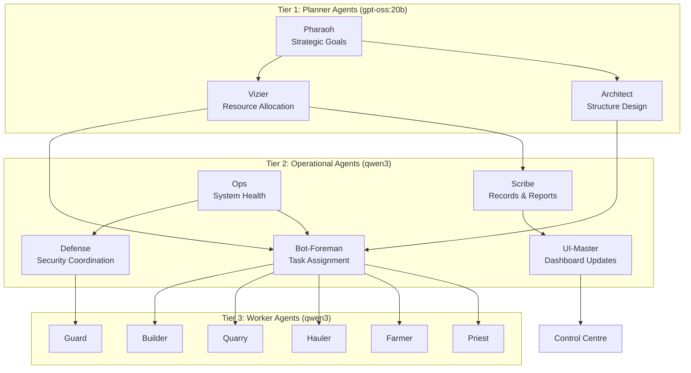

### Operating Modes State Diagram

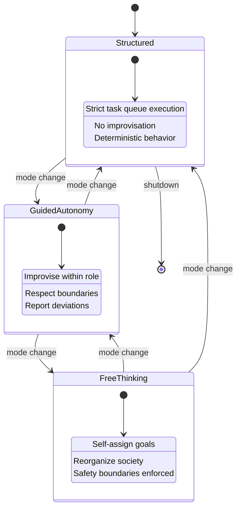

### Package Structure

```
pyramid-os/
├── packages/
│   ├── orchestration/        # OpenClaw agent orchestrator
│   │   ├── src/
│   │   │   ├── openclaw.ts           # Main orchestrator
│   │   │   ├── agent-manager.ts      # Agent lifecycle
│   │   │   ├── workspace.ts          # Agent workspace isolation
│   │   │   ├── message-bus.ts        # Inter-agent communication
│   │   │   ├── llm-router.ts         # Ollama request routing
│   │   │   ├── mode-controller.ts    # Operating mode management
│   │   │   ├── safety-enforcer.ts    # Safety boundary enforcement
│   │   │   └── recovery.ts           # Failure recovery
│   │   └── package.json
│   ├── minecraft-controller/ # Mineflayer bot control
│   │   ├── src/
│   │   │   ├── controller.ts         # Main controller service
│   │   │   ├── bot-manager.ts        # Bot lifecycle & registry
│   │   │   ├── server-connector.ts   # Server connection handling
│   │   │   ├── pathfinder.ts         # A* pathfinding
│   │   │   ├── action-executor.ts    # Bot action translation
│   │   │   └── rate-limiter.ts       # Action rate limiting
│   │   └── package.json
│   ├── society-engine/       # Planning and scheduling
│   │   ├── src/
│   │   │   ├── engine.ts             # Main society engine
│   │   │   ├── task-queue.ts         # Priority task queues
│   │   │   ├── resource-tracker.ts   # Resource inventory
│   │   │   ├── zone-manager.ts       # Spatial zone management
│   │   │   ├── build-phase.ts        # Build phase sequencing
│   │   │   ├── dependency-graph.ts   # Task dependency DAG
│   │   │   ├── ceremony-manager.ts   # Cultural ceremonies
│   │   │   └── metrics-collector.ts  # Performance metrics
│   │   └── package.json
│   ├── blueprint/            # Blueprint system
│   │   ├── src/
│   │   │   ├── blueprint.ts          # Blueprint data model
│   │   │   ├── generator.ts          # Pyramid & district generators
│   │   │   ├── validator.ts          # Blueprint validation
│   │   │   ├── serializer.ts         # JSON serialization
│   │   │   └── progress-tracker.ts   # Construction progress
│   │   └── package.json
│   ├── control-centre/       # Visual dashboard
│   │   ├── src/
│   │   │   ├── app.ts               # Dashboard application
│   │   │   ├── renderer.ts          # Canvas/A2UI rendering
│   │   │   ├── theme.ts             # Egyptian theme config
│   │   │   ├── panels/              # Dashboard panels
│   │   │   └── websocket-client.ts  # Real-time updates
│   │   └── package.json
│   ├── shared-types/         # Shared TypeScript types
│   │   ├── src/
│   │   │   ├── agent.ts             # Agent types
│   │   │   ├── task.ts              # Task types
│   │   │   ├── resource.ts          # Resource types
│   │   │   ├── blueprint.ts         # Blueprint types
│   │   │   ├── config.ts            # Configuration types
│   │   │   ├── events.ts            # Event types
│   │   │   └── api.ts               # API request/response types
│   │   └── package.json
│   ├── data-layer/           # SQLite + JSON persistence
│   │   ├── src/
│   │   │   ├── database.ts          # SQLite connection & pooling
│   │   │   ├── repositories/        # Entity repositories
│   │   │   ├── migrations/          # Schema migrations
│   │   │   ├── snapshot.ts          # JSON snapshot export/import
│   │   │   └── backup.ts            # Database backup
│   │   └── package.json
│   ├── api/                  # Fastify REST API + WebSocket
│   │   ├── src/
│   │   │   ├── server.ts            # Fastify server setup
│   │   │   ├── routes/              # API route handlers
│   │   │   ├── websocket.ts         # WebSocket server
│   │   │   ├── auth.ts              # API key authentication
│   │   │   └── rate-limiter.ts      # Request rate limiting
│   │   └── package.json
│   ├── cli/                  # Command-line interface
│   │   ├── src/
│   │   │   ├── index.ts             # CLI entry point
│   │   │   ├── commands/            # Command implementations
│   │   │   └── formatters.ts        # Output formatters
│   │   └── package.json
│   └── logger/               # Structured logging
│       ├── src/
│       │   ├── logger.ts            # Logger implementation
│       │   ├── rotation.ts          # Log file rotation
│       │   └── correlation.ts       # Correlation ID tracking
│       └── package.json
├── scripts/
│   ├── install.ps1               # Windows installation script
│   └── health-check.ps1         # Health check script
├── config/
│   └── default.yaml              # Default configuration
├── docs/
│   ├── architecture.md
│   └── api.md
├── pnpm-workspace.yaml
├── tsconfig.base.json
├── package.json
└── README.md
```


## Components and Interfaces

### 1. OpenClaw Orchestrator (`packages/orchestration`)

The central nervous system of PYRAMID OS. Manages agent lifecycle, enforces workspace isolation, routes LLM requests, and coordinates inter-agent communication.

#### Core Interface

```typescript
// packages/orchestration/src/openclaw.ts

interface OpenClaw {
  /** Initialize orchestrator, load persisted agent states */
  initialize(config: PyramidConfig): Promise<void>;

  /** Spawn a new agent with role-specific workspace */
  spawnAgent(role: AgentRole, options?: SpawnOptions): Promise<AgentInstance>;

  /** Terminate an agent, persisting its state */
  terminateAgent(agentId: string): Promise<void>;

  /** Submit an LLM request routed by agent tier */
  requestLLM(agentId: string, prompt: LLMPrompt): Promise<LLMResponse>;

  /** Send a message between agents (hierarchy-enforced) */
  sendMessage(from: string, to: string, message: AgentMessage): Promise<void>;

  /** Broadcast message from planner to all agents */
  broadcast(from: string, message: AgentMessage): Promise<void>;

  /** Change operating mode with graceful transition */
  setOperatingMode(mode: OperatingMode): Promise<void>;

  /** Get current system state */
  getState(): SystemState;

  /** Graceful shutdown — persist all state */
  shutdown(): Promise<void>;
}
```

#### Agent Manager

```typescript
// packages/orchestration/src/agent-manager.ts

interface AgentManager {
  /** Create agent instance with isolated workspace */
  create(role: AgentRole, config: AgentConfig): Promise<AgentInstance>;

  /** Get agent by ID */
  get(agentId: string): AgentInstance | undefined;

  /** List all agents, optionally filtered by tier or role */
  list(filter?: AgentFilter): AgentInstance[];

  /** Restart a failed agent, reassigning its tasks */
  restart(agentId: string): Promise<void>;

  /** Persist agent state to SQLite */
  persistState(agentId: string): Promise<void>;

  /** Restore agent state from SQLite */
  restoreState(agentId: string): Promise<void>;

  /** Health check all agents */
  healthCheck(): Promise<AgentHealthReport[]>;
}
```

#### Workspace Isolation

```typescript
// packages/orchestration/src/workspace.ts

interface AgentWorkspace {
  agentId: string;
  role: AgentRole;
  tier: AgentTier;

  /** Tools this agent is allowed to use */
  allowedTools: ToolName[];

  /** Role-specific context and memory */
  context: AgentContext;

  /** Validate a tool request against workspace permissions */
  validateToolAccess(tool: ToolName): boolean;

  /** Persist workspace state */
  save(): Promise<void>;

  /** Restore workspace state */
  load(): Promise<void>;
}

/** Tool permissions by tier */
const WORKSPACE_TEMPLATES: Record<AgentTier, ToolName[]> = {
  planner: ['strategic-plan', 'approve-blueprint', 'set-priority', 'allocate-resources', 'broadcast'],
  operational: ['assign-task', 'query-status', 'monitor-health', 'update-display', 'manage-bots'],
  worker: ['execute-action', 'report-status', 'query-inventory', 'request-path'],
};
```

#### LLM Router

```typescript
// packages/orchestration/src/llm-router.ts

interface LLMRouter {
  /** Route request to appropriate Ollama model based on agent tier */
  route(agentId: string, prompt: LLMPrompt): Promise<LLMResponse>;

  /** Queue request if Ollama is overloaded */
  enqueue(request: LLMRequest): void;

  /** Check Ollama availability */
  healthCheck(): Promise<OllamaHealth>;

  /** Get performance metrics */
  getMetrics(): LLMMetrics;
}

/** Model selection by tier */
const MODEL_MAP: Record<AgentTier, string> = {
  planner: 'gpt-oss:20b',
  operational: 'qwen3',
  worker: 'qwen3',
};
```

#### Safety Enforcer

```typescript
// packages/orchestration/src/safety-enforcer.ts

interface SafetyEnforcer {
  /** Validate an agent action against safety boundaries */
  validate(agentId: string, action: AgentAction): SafetyResult;

  /** Check for prohibited block types (TNT, lava, fire) */
  isProhibitedBlock(blockType: string): boolean;

  /** Check for prohibited commands */
  isProhibitedCommand(command: string): boolean;

  /** Enforce timeout on agent operations */
  enforceTimeout(agentId: string, operationMs: number): void;

  /** Emergency stop — halt all agents and bots immediately */
  emergencyStop(): Promise<void>;
}

interface SafetyBoundary {
  prohibitedBlocks: string[];       // ['tnt', 'lava', 'fire']
  prohibitedCommands: string[];     // ['/op', '/gamemode', '/kill']
  maxDecisionTimeMs: number;        // 30000
  maxActionsPerSecond: number;      // 10
  maxReasoningLoops: number;        // 50
}
```

### 2. Minecraft Controller (`packages/minecraft-controller`)

Bridges agent commands to in-game Mineflayer bot actions. Manages connections, pathfinding, and bot health.

#### Controller Interface

```typescript
// packages/minecraft-controller/src/controller.ts

interface MinecraftController {
  /** Connect a bot to a Minecraft server */
  connectBot(profile: ConnectionProfile, role: WorkerRole): Promise<BotInstance>;

  /** Disconnect a bot gracefully */
  disconnectBot(botId: string): Promise<void>;

  /** Execute a bot action (place block, mine, move, attack, etc.) */
  executeAction(botId: string, action: BotAction): Promise<ActionResult>;

  /** Get bot status (position, health, inventory, connection) */
  getBotStatus(botId: string): BotStatus;

  /** List all active bots */
  listBots(): BotInstance[];

  /** Navigate bot to coordinates using A* pathfinding */
  navigateTo(botId: string, target: Vec3): Promise<NavigationResult>;
}
```

#### Server Connector

```typescript
// packages/minecraft-controller/src/server-connector.ts

interface ServerConnector {
  /** Connect to a local LAN world (no auth) */
  connectLocal(host: string, port: number): Promise<Connection>;

  /** Connect with username/password */
  connectWithCredentials(host: string, port: number, username: string, password: string): Promise<Connection>;

  /** Connect with Microsoft account */
  connectMicrosoft(host: string, port: number, msToken: string): Promise<Connection>;

  /** Validate server compatibility */
  validateServer(connection: Connection): Promise<ServerValidation>;

  /** Monitor connection health */
  getHealth(connectionId: string): ConnectionHealth;

  /** Detect disconnection (within 10 seconds) */
  onDisconnect(connectionId: string, callback: (reason: string) => void): void;
}

interface ConnectionProfile {
  name: string;
  host: string;
  port: number;
  authMethod: 'none' | 'credentials' | 'microsoft';
  credentials?: { username: string; password: string };
  msToken?: string;
  version?: string;
}
```

#### Pathfinder

```typescript
// packages/minecraft-controller/src/pathfinder.ts

interface Pathfinder {
  /** Calculate A* path from start to goal */
  findPath(start: Vec3, goal: Vec3, options?: PathOptions): Promise<Path>;

  /** Recalculate path when blocked */
  recalculate(currentPath: Path, obstacleAt: Vec3): Promise<Path>;

  /** Cache a frequently used path */
  cachePath(key: string, path: Path): void;

  /** Get cached path */
  getCachedPath(key: string): Path | undefined;

  /** Define waypoint patrol route */
  createPatrolRoute(waypoints: Vec3[]): PatrolRoute;
}

interface PathOptions {
  avoidWater: boolean;
  avoidLava: boolean;
  avoidHostileMobs: boolean;
  maxDistance: number;
  canSwim: boolean;
  canClimb: boolean;
}
```

#### Rate Limiter

```typescript
// packages/minecraft-controller/src/rate-limiter.ts

interface BotRateLimiter {
  /** Check if action is allowed under rate limit */
  canExecute(botId: string): boolean;

  /** Record an action execution */
  recordAction(botId: string): void;

  /** Get current rate for a bot */
  getRate(botId: string): { current: number; max: number };
}

// Token bucket: max 10 actions/second per bot, refills at 10/sec
```

### 3. Society Engine (`packages/society-engine`)

The planning brain. Manages task queues, resource tracking, zone management, build phases, task dependencies, and ceremonies.

#### Engine Interface

```typescript
// packages/society-engine/src/engine.ts

interface SocietyEngine {
  /** Initialize engine, load state from SQLite */
  initialize(db: Database): Promise<void>;

  /** Create a task with optional dependencies */
  createTask(task: TaskDefinition): Promise<Task>;

  /** Assign task to a worker agent */
  assignTask(taskId: string, agentId: string): Promise<void>;

  /** Complete a task, triggering dependent tasks */
  completeTask(taskId: string, result: TaskResult): Promise<void>;

  /** Get task recommendations for an operational agent */
  getRecommendations(agentId: string): Task[];

  /** Update resource inventory */
  updateResource(resourceId: string, delta: number): Promise<void>;

  /** Define a spatial zone */
  defineZone(zone: ZoneDefinition): Promise<Zone>;

  /** Start a build phase sequence */
  startBuildSequence(blueprintId: string): Promise<BuildSequence>;

  /** Schedule a ceremony */
  scheduleCeremony(ceremony: CeremonyDefinition): Promise<Ceremony>;

  /** Get metrics snapshot */
  getMetrics(): SocietyMetrics;
}
```

#### Task Queue

```typescript
// packages/society-engine/src/task-queue.ts

interface TaskQueue {
  /** Add task with priority */
  enqueue(task: Task, priority: TaskPriority): void;

  /** Get next task for an agent */
  dequeue(agentId: string): Task | undefined;

  /** Peek at next task without removing */
  peek(agentId: string): Task | undefined;

  /** Get all tasks for an agent */
  listTasks(agentId: string): Task[];

  /** Mark task as blocked */
  blockTask(taskId: string, reason: string): void;

  /** Retry a failed task */
  retryTask(taskId: string): void;

  /** Get queue length per agent */
  getQueueLengths(): Map<string, number>;
}

type TaskPriority = 'critical' | 'high' | 'normal' | 'low';
```

#### Resource Tracker

```typescript
// packages/society-engine/src/resource-tracker.ts

interface ResourceTracker {
  /** Get current inventory level */
  getLevel(resourceType: ResourceType): number;

  /** Update inventory (positive = add, negative = consume) */
  update(resourceType: ResourceType, delta: number, reason: string): Promise<void>;

  /** Check if resource is below threshold */
  isBelowThreshold(resourceType: ResourceType): boolean;

  /** Get all resources below threshold */
  getLowResources(): ResourceAlert[];

  /** Predict resource needs for upcoming build phases */
  predictNeeds(phases: BuildPhase[]): ResourcePrediction;

  /** Get resource transaction history */
  getTransactions(filter?: TransactionFilter): ResourceTransaction[];
}

interface ResourceThreshold {
  resourceType: ResourceType;
  minimum: number;
  critical: number;
}
```

#### Dependency Graph

```typescript
// packages/society-engine/src/dependency-graph.ts

interface DependencyGraph {
  /** Add a task node */
  addTask(task: Task): void;

  /** Add dependency edge (taskB depends on taskA) */
  addDependency(taskId: string, dependsOn: string): void;

  /** Check for circular dependencies */
  detectCycles(): CycleReport | null;

  /** Get tasks ready for execution (all deps satisfied) */
  getReadyTasks(): Task[];

  /** Mark task complete, update dependents */
  markComplete(taskId: string): Task[];  // returns newly ready tasks

  /** Mark task failed, block dependents */
  markFailed(taskId: string): Task[];    // returns blocked tasks

  /** Get tasks that can run in parallel */
  getParallelGroups(): Task[][];

  /** Topological sort for execution order */
  topologicalSort(): Task[];
}
```

### 4. Blueprint System (`packages/blueprint`)

Defines, generates, validates, and tracks construction plans.

#### Blueprint Model

```typescript
// packages/blueprint/src/blueprint.ts

interface Blueprint {
  id: string;
  name: string;
  version: number;
  type: 'pyramid' | 'housing' | 'farm' | 'temple' | 'custom';
  dimensions: Dimensions;
  metadata: BlueprintMetadata;
  placements: BlockPlacement[];
  progress: BlueprintProgress;
}

interface BlockPlacement {
  index: number;          // execution order
  position: Vec3;         // world coordinates
  blockType: string;      // minecraft block ID
  placed: boolean;        // tracking flag
}

interface BlueprintMetadata {
  structureName: string;
  dimensions: Dimensions;
  requiredResources: ResourceRequirement[];
  estimatedTimeMinutes: number;
  createdAt: string;
  createdBy: string;      // architect agent ID
}

interface Dimensions {
  width: number;
  height: number;
  depth: number;
}

interface BlueprintProgress {
  totalBlocks: number;
  placedBlocks: number;
  percentComplete: number;
  currentPhase: string;
}
```

#### Blueprint Generator

```typescript
// packages/blueprint/src/generator.ts

interface BlueprintGenerator {
  /** Generate a pyramid blueprint */
  generatePyramid(params: PyramidParams): Blueprint;

  /** Generate a housing district blueprint */
  generateHousing(params: HousingParams): Blueprint;

  /** Generate a farm district blueprint */
  generateFarm(params: FarmParams): Blueprint;

  /** Generate a temple blueprint */
  generateTemple(params: TempleParams): Blueprint;
}

interface PyramidParams {
  baseSize: number;       // base edge length
  height: number;         // pyramid height
  material: string;       // primary block type
  capMaterial: string;    // capstone block type
  origin: Vec3;           // world position
}

// Pyramid generation algorithm:
// For each layer y from 0 to height:
//   inset = floor(y * baseSize / (2 * height))
//   For x from inset to (baseSize - inset - 1):
//     For z from inset to (baseSize - inset - 1):
//       if y == height - 1: place capMaterial
//       else: place material at (origin.x + x, origin.y + y, origin.z + z)
```

#### Blueprint Validator

```typescript
// packages/blueprint/src/validator.ts

interface BlueprintValidator {
  /** Validate a blueprint for completeness and feasibility */
  validate(blueprint: Blueprint): ValidationResult;

  /** Check all block types exist in Minecraft */
  validateBlockTypes(placements: BlockPlacement[]): ValidationError[];

  /** Check coordinates are within bounds */
  validateCoordinates(placements: BlockPlacement[]): ValidationError[];

  /** Check structural stability (no floating blocks) */
  validateStability(placements: BlockPlacement[]): ValidationError[];

  /** Calculate total resource requirements */
  calculateResources(placements: BlockPlacement[]): ResourceRequirement[];

  /** Detect conflicts with existing blueprints */
  detectConflicts(blueprint: Blueprint, existing: Blueprint[]): ConflictReport[];
}

interface ValidationResult {
  valid: boolean;
  errors: ValidationError[];
  warnings: ValidationWarning[];
  resourceRequirements: ResourceRequirement[];
}
```

#### Blueprint Serializer

```typescript
// packages/blueprint/src/serializer.ts

interface BlueprintSerializer {
  /** Serialize blueprint to JSON string */
  serialize(blueprint: Blueprint): string;

  /** Deserialize JSON string to blueprint */
  deserialize(json: string): Blueprint;

  /** Validate JSON structure before deserialization */
  validateJson(json: string): boolean;
}

// Round-trip property: deserialize(serialize(blueprint)) === blueprint
```

### 5. Data Layer (`packages/data-layer`)

SQLite persistence with repository pattern, migrations, snapshots, and backups.

#### Database Manager

```typescript
// packages/data-layer/src/database.ts

interface DatabaseManager {
  /** Initialize database with connection pooling */
  initialize(dbPath: string): Promise<void>;

  /** Run pending migrations */
  migrate(): Promise<void>;

  /** Create backup before migration */
  backup(backupPath: string): Promise<void>;

  /** Verify data integrity with checksums */
  verifyIntegrity(): Promise<IntegrityReport>;

  /** Get connection from pool */
  getConnection(): DatabaseConnection;

  /** Close all connections */
  close(): Promise<void>;
}
```

#### Snapshot Manager

```typescript
// packages/data-layer/src/snapshot.ts

interface SnapshotManager {
  /** Export complete system state to JSON */
  export(): Promise<JsonSnapshot>;

  /** Import system state from JSON snapshot */
  import(snapshot: JsonSnapshot): Promise<void>;

  /** Validate snapshot structure */
  validate(snapshot: JsonSnapshot): ValidationResult;

  /** List available snapshots */
  list(): Promise<SnapshotInfo[]>;
}

// Round-trip property: import(export()) restores equivalent state
```

### 6. API Layer (`packages/api`)

Fastify REST API with WebSocket for real-time updates.

#### Route Map

| Method | Path | Description | Auth |
|--------|------|-------------|------|
| GET | /agents | List all agents | API Key |
| GET | /agents/:id | Get agent details | API Key |
| GET | /tasks | List tasks (filterable) | API Key |
| GET | /tasks/:id | Get task details | API Key |
| GET | /resources | Get resource inventory | API Key |
| GET | /builds | List active builds | API Key |
| GET | /builds/:id | Get build progress | API Key |
| POST | /system/start | Start the system | API Key |
| POST | /system/stop | Stop the system | API Key |
| POST | /system/pause | Pause operations | API Key |
| POST | /system/mode | Change operating mode | API Key |
| GET | /snapshots/export | Export JSON snapshot | API Key |
| POST | /snapshots/import | Import JSON snapshot | API Key |
| GET | /health | Health check status | None |
| GET | /metrics | Prometheus metrics | API Key |

#### WebSocket Events

```typescript
// packages/api/src/websocket.ts

type WebSocketEvent =
  | { type: 'agent:state'; agentId: string; state: AgentState }
  | { type: 'task:complete'; taskId: string; result: TaskResult }
  | { type: 'resource:update'; resourceType: string; level: number }
  | { type: 'bot:connect'; botId: string; server: string }
  | { type: 'bot:disconnect'; botId: string; reason: string }
  | { type: 'build:progress'; buildId: string; percent: number }
  | { type: 'alert'; severity: AlertSeverity; message: string }
  | { type: 'ceremony:start'; ceremonyId: string }
  | { type: 'health:update'; component: string; status: HealthStatus };

interface WebSocketServer {
  /** Broadcast event to all connected clients */
  broadcast(event: WebSocketEvent): void;

  /** Send event to specific client */
  send(clientId: string, event: WebSocketEvent): void;

  /** Authenticate WebSocket connection */
  authenticate(token: string): boolean;
}

// Event batching: aggregate rapid updates into 100ms windows
```

#### API Error Format

```typescript
interface ApiError {
  statusCode: number;
  error: string;
  message: string;
  code: string;          // e.g., 'AGENT_NOT_FOUND', 'INVALID_MODE'
  details?: unknown;
}
```

### 7. Logger (`packages/logger`)

Structured logging with rotation, correlation IDs, and multi-output.

```typescript
// packages/logger/src/logger.ts

interface Logger {
  debug(message: string, context?: LogContext): void;
  info(message: string, context?: LogContext): void;
  warn(message: string, context?: LogContext): void;
  error(message: string, error?: Error, context?: LogContext): void;
}

interface LogContext {
  correlationId?: string;
  agentId?: string;
  botId?: string;
  taskId?: string;
  component?: string;
  [key: string]: unknown;
}

// Output: console + rotating files (max 10MB, gzip compressed)
// Format: JSON structured logs with ISO timestamps
```

### 8. CLI (`packages/cli`)

Command-line interface for system administration.

```typescript
// Command structure:
// pyramid-os system start|stop|restart|status
// pyramid-os agent list|spawn|terminate|inspect <id>
// pyramid-os task list|create|cancel|retry <id>
// pyramid-os resource inventory|thresholds|consumption
// pyramid-os blueprint generate|validate|export|import <file>
// pyramid-os snapshot create|restore|list
// pyramid-os config validate|test
// pyramid-os log query --level=<level> --agent=<id> --since=<time>
// pyramid-os health check
// pyramid-os civilization create|list|delete|switch <name>

// Output formats: --format=json|table|text
```

### 9. Control Centre (`packages/control-centre`)

Egyptian-themed Canvas/A2UI dashboard served via the API layer.

#### Theme Configuration

```typescript
// packages/control-centre/src/theme.ts

const EGYPTIAN_THEME = {
  colors: {
    sandstone: '#C2B280',
    gold: '#FFD700',
    lapis: '#1E90FF',
    papyrus: '#F5E6C8',
    obsidian: '#1A1A2E',
    copper: '#B87333',
    turquoise: '#40E0D0',
    hieroglyphRed: '#C41E3A',
  },
  fonts: {
    heading: 'Minecraft-inspired serif',
    body: 'Monospace for data',
  },
  panels: {
    borderStyle: 'hieroglyphic border pattern',
    cornerDecoration: 'ankh symbols',
  },
};
```

#### Dashboard Panels

- **Agent Overview** — grid of all agents with status indicators (active/idle/error)
- **Build Progress** — pyramid visualization with percentage, current phase, ETA
- **Resource Dashboard** — bar charts with color-coded levels (green/yellow/red)
- **Map View** — top-down view of bot positions and zone boundaries
- **Alert Feed** — scrolling list of alerts with severity icons
- **Ceremony Calendar** — upcoming ceremonies with countdown timers
- **Metrics Charts** — time-series graphs for key performance indicators
- **Log Viewer** — filterable log stream with severity highlighting
- **System Controls** — start/stop/pause buttons, mode selector, emergency stop


## Data Models

### SQLite Schema

```sql
-- Agent registry
CREATE TABLE agents (
  id TEXT PRIMARY KEY,
  role TEXT NOT NULL,                    -- 'pharaoh', 'vizier', 'builder', etc.
  tier TEXT NOT NULL,                    -- 'planner', 'operational', 'worker'
  status TEXT NOT NULL DEFAULT 'idle',   -- 'idle', 'active', 'error', 'terminated'
  operating_mode TEXT NOT NULL,          -- 'structured', 'guided_autonomy', 'free_thinking'
  last_decision TEXT,                    -- JSON: most recent reasoning summary
  workspace_state TEXT,                  -- JSON: serialized workspace context
  civilization_id TEXT NOT NULL,
  created_at TEXT NOT NULL DEFAULT (datetime('now')),
  updated_at TEXT NOT NULL DEFAULT (datetime('now')),
  FOREIGN KEY (civilization_id) REFERENCES civilizations(id)
);
CREATE INDEX idx_agents_role ON agents(role);
CREATE INDEX idx_agents_civilization ON agents(civilization_id);

-- Task management
CREATE TABLE tasks (
  id TEXT PRIMARY KEY,
  type TEXT NOT NULL,                    -- 'build', 'mine', 'haul', 'patrol', 'farm', 'ceremony'
  status TEXT NOT NULL DEFAULT 'pending',-- 'pending', 'assigned', 'in_progress', 'completed', 'failed', 'blocked'
  priority TEXT NOT NULL DEFAULT 'normal',-- 'critical', 'high', 'normal', 'low'
  assigned_agent_id TEXT,
  description TEXT NOT NULL,
  parameters TEXT,                       -- JSON: task-specific parameters
  result TEXT,                           -- JSON: completion result
  retry_count INTEGER NOT NULL DEFAULT 0,
  max_retries INTEGER NOT NULL DEFAULT 3,
  civilization_id TEXT NOT NULL,
  created_at TEXT NOT NULL DEFAULT (datetime('now')),
  completed_at TEXT,
  FOREIGN KEY (assigned_agent_id) REFERENCES agents(id),
  FOREIGN KEY (civilization_id) REFERENCES civilizations(id)
);
CREATE INDEX idx_tasks_status ON tasks(status);
CREATE INDEX idx_tasks_agent ON tasks(assigned_agent_id);
CREATE INDEX idx_tasks_priority ON tasks(priority);

-- Task dependencies (DAG edges)
CREATE TABLE task_dependencies (
  task_id TEXT NOT NULL,
  depends_on_task_id TEXT NOT NULL,
  PRIMARY KEY (task_id, depends_on_task_id),
  FOREIGN KEY (task_id) REFERENCES tasks(id),
  FOREIGN KEY (depends_on_task_id) REFERENCES tasks(id)
);

-- Resource inventory
CREATE TABLE resources (
  id TEXT PRIMARY KEY,
  type TEXT NOT NULL,                    -- 'sandstone', 'gold_block', 'wheat', etc.
  quantity INTEGER NOT NULL DEFAULT 0,
  minimum_threshold INTEGER NOT NULL DEFAULT 0,
  critical_threshold INTEGER NOT NULL DEFAULT 0,
  zone_id TEXT,
  civilization_id TEXT NOT NULL,
  updated_at TEXT NOT NULL DEFAULT (datetime('now')),
  FOREIGN KEY (zone_id) REFERENCES zones(id),
  FOREIGN KEY (civilization_id) REFERENCES civilizations(id)
);
CREATE INDEX idx_resources_type ON resources(type);

-- Resource transaction log
CREATE TABLE resource_transactions (
  id TEXT PRIMARY KEY,
  resource_type TEXT NOT NULL,
  delta INTEGER NOT NULL,
  reason TEXT NOT NULL,
  agent_id TEXT,
  before_quantity INTEGER NOT NULL,
  after_quantity INTEGER NOT NULL,
  civilization_id TEXT NOT NULL,
  created_at TEXT NOT NULL DEFAULT (datetime('now')),
  FOREIGN KEY (civilization_id) REFERENCES civilizations(id)
);

-- Spatial zones
CREATE TABLE zones (
  id TEXT PRIMARY KEY,
  name TEXT NOT NULL,
  type TEXT NOT NULL,                    -- 'quarry', 'construction', 'farm', 'temple', 'storage', 'patrol'
  bounds_min_x INTEGER NOT NULL,
  bounds_min_y INTEGER NOT NULL,
  bounds_min_z INTEGER NOT NULL,
  bounds_max_x INTEGER NOT NULL,
  bounds_max_y INTEGER NOT NULL,
  bounds_max_z INTEGER NOT NULL,
  civilization_id TEXT NOT NULL,
  created_at TEXT NOT NULL DEFAULT (datetime('now')),
  FOREIGN KEY (civilization_id) REFERENCES civilizations(id)
);

-- Blueprints
CREATE TABLE blueprints (
  id TEXT PRIMARY KEY,
  name TEXT NOT NULL,
  version INTEGER NOT NULL DEFAULT 1,
  type TEXT NOT NULL,                    -- 'pyramid', 'housing', 'farm', 'temple', 'custom'
  dimensions_json TEXT NOT NULL,         -- JSON: {width, height, depth}
  metadata_json TEXT NOT NULL,           -- JSON: BlueprintMetadata
  placements_json TEXT NOT NULL,         -- JSON: BlockPlacement[]
  progress_json TEXT NOT NULL,           -- JSON: BlueprintProgress
  civilization_id TEXT NOT NULL,
  created_at TEXT NOT NULL DEFAULT (datetime('now')),
  updated_at TEXT NOT NULL DEFAULT (datetime('now')),
  FOREIGN KEY (civilization_id) REFERENCES civilizations(id)
);

-- Build phases
CREATE TABLE build_phases (
  id TEXT PRIMARY KEY,
  blueprint_id TEXT NOT NULL,
  name TEXT NOT NULL,                    -- 'foundation', 'layer_1', 'capstone', etc.
  sequence_order INTEGER NOT NULL,
  status TEXT NOT NULL DEFAULT 'pending',-- 'pending', 'in_progress', 'completed', 'verified'
  start_block_index INTEGER NOT NULL,
  end_block_index INTEGER NOT NULL,
  civilization_id TEXT NOT NULL,
  started_at TEXT,
  completed_at TEXT,
  FOREIGN KEY (blueprint_id) REFERENCES blueprints(id),
  FOREIGN KEY (civilization_id) REFERENCES civilizations(id)
);

-- Bot registry
CREATE TABLE bots (
  id TEXT PRIMARY KEY,
  username TEXT NOT NULL,
  role TEXT NOT NULL,                    -- worker role assigned
  agent_id TEXT,                         -- controlling agent
  server_profile TEXT NOT NULL,          -- connection profile name
  status TEXT NOT NULL DEFAULT 'disconnected', -- 'connected', 'disconnected', 'error'
  position_json TEXT,                    -- JSON: {x, y, z}
  health REAL,
  food REAL,
  inventory_json TEXT,                   -- JSON: inventory contents
  civilization_id TEXT NOT NULL,
  connected_at TEXT,
  updated_at TEXT NOT NULL DEFAULT (datetime('now')),
  FOREIGN KEY (agent_id) REFERENCES agents(id),
  FOREIGN KEY (civilization_id) REFERENCES civilizations(id)
);

-- Ceremonies
CREATE TABLE ceremonies (
  id TEXT PRIMARY KEY,
  type TEXT NOT NULL,                    -- 'harvest_festival', 'pyramid_dedication', 'coronation'
  status TEXT NOT NULL DEFAULT 'scheduled', -- 'scheduled', 'in_progress', 'completed', 'cancelled'
  scheduled_at TEXT NOT NULL,
  location_zone_id TEXT,
  parameters_json TEXT,                  -- JSON: ceremony-specific config
  result_json TEXT,                      -- JSON: ceremony effects
  civilization_id TEXT NOT NULL,
  FOREIGN KEY (location_zone_id) REFERENCES zones(id),
  FOREIGN KEY (civilization_id) REFERENCES civilizations(id)
);

-- Civilizations (multi-world support)
CREATE TABLE civilizations (
  id TEXT PRIMARY KEY,
  name TEXT NOT NULL UNIQUE,
  server_profile TEXT NOT NULL,
  operating_mode TEXT NOT NULL DEFAULT 'structured',
  status TEXT NOT NULL DEFAULT 'active', -- 'active', 'paused', 'archived'
  created_at TEXT NOT NULL DEFAULT (datetime('now')),
  updated_at TEXT NOT NULL DEFAULT (datetime('now'))
);

-- Agent messages (communication log)
CREATE TABLE agent_messages (
  id TEXT PRIMARY KEY,
  sender_id TEXT NOT NULL,
  receiver_id TEXT,                      -- NULL for broadcasts
  content TEXT NOT NULL,                 -- JSON: message payload
  message_type TEXT NOT NULL,            -- 'directive', 'request', 'response', 'broadcast'
  correlation_id TEXT,
  civilization_id TEXT NOT NULL,
  created_at TEXT NOT NULL DEFAULT (datetime('now')),
  FOREIGN KEY (civilization_id) REFERENCES civilizations(id)
);
CREATE INDEX idx_messages_sender ON agent_messages(sender_id);
CREATE INDEX idx_messages_correlation ON agent_messages(correlation_id);

-- Health check results
CREATE TABLE health_checks (
  id TEXT PRIMARY KEY,
  component TEXT NOT NULL,               -- 'ollama', 'sqlite', 'minecraft', 'agents'
  status TEXT NOT NULL,                  -- 'healthy', 'degraded', 'failed'
  details_json TEXT,
  checked_at TEXT NOT NULL DEFAULT (datetime('now'))
);

-- Security incidents
CREATE TABLE security_incidents (
  id TEXT PRIMARY KEY,
  agent_id TEXT NOT NULL,
  violation_type TEXT NOT NULL,          -- 'prohibited_block', 'prohibited_command', 'timeout', 'permission'
  details TEXT NOT NULL,
  action_taken TEXT NOT NULL,            -- 'rejected', 'halted', 'logged'
  civilization_id TEXT NOT NULL,
  created_at TEXT NOT NULL DEFAULT (datetime('now')),
  FOREIGN KEY (civilization_id) REFERENCES civilizations(id)
);

-- Metrics time-series
CREATE TABLE metrics (
  id INTEGER PRIMARY KEY AUTOINCREMENT,
  metric_name TEXT NOT NULL,
  metric_value REAL NOT NULL,
  labels_json TEXT,                      -- JSON: {agent_role, resource_type, etc.}
  civilization_id TEXT NOT NULL,
  recorded_at TEXT NOT NULL DEFAULT (datetime('now'))
);
CREATE INDEX idx_metrics_name ON metrics(metric_name);
CREATE INDEX idx_metrics_time ON metrics(recorded_at);
```

### JSON Snapshot Structure

```typescript
interface JsonSnapshot {
  version: string;                       // schema version
  exportedAt: string;                    // ISO timestamp
  civilization: {
    id: string;
    name: string;
    operatingMode: OperatingMode;
    status: string;
  };
  agents: AgentSnapshot[];
  tasks: TaskSnapshot[];
  resources: ResourceSnapshot[];
  zones: ZoneSnapshot[];
  blueprints: BlueprintSnapshot[];
  buildPhases: BuildPhaseSnapshot[];
  bots: BotSnapshot[];
  ceremonies: CeremonySnapshot[];
  metrics: MetricSnapshot[];
}

// Round-trip: parse(serialize(snapshot)) ≡ snapshot
```

### Configuration Schema

```yaml
# config/default.yaml
ollama:
  host: "127.0.0.1"
  port: 11434
  timeout_ms: 30000
  models:
    planner: "gpt-oss:20b"
    worker: "qwen3"
  max_concurrent_requests: 4

minecraft:
  profiles:
    - name: "local"
      host: "127.0.0.1"
      port: 25565
      auth: "none"
    - name: "remote"
      host: "mc.example.com"
      port: 25565
      auth: "microsoft"

agents:
  planners:
    - role: "pharaoh"
      count: 1
    - role: "vizier"
      count: 1
    - role: "architect"
      count: 1
  operational:
    - role: "scribe"
      count: 1
    - role: "bot-foreman"
      count: 1
    - role: "defense"
      count: 1
    - role: "ops"
      count: 1
    - role: "ui-master"
      count: 1
  workers:
    - role: "builder"
      count: 4
    - role: "quarry"
      count: 2
    - role: "hauler"
      count: 2
    - role: "guard"
      count: 2
    - role: "farmer"
      count: 2
    - role: "priest"
      count: 1

resources:
  thresholds:
    sandstone: { minimum: 100, critical: 20 }
    gold_block: { minimum: 20, critical: 5 }
    wheat: { minimum: 50, critical: 10 }
    iron_ingot: { minimum: 30, critical: 5 }

safety:
  prohibited_blocks: ["tnt", "lava_bucket", "fire_charge"]
  prohibited_commands: ["/op", "/gamemode", "/kill", "/ban"]
  max_decision_time_ms: 30000
  max_actions_per_second: 10
  max_reasoning_loops: 50

control_centre:
  port: 3000
  theme: "egyptian"
  refresh_rate_ms: 1000

logging:
  level: "info"
  output:
    console: true
    file: true
  file_path: "./logs"
  max_file_size_mb: 10
  rotation_count: 5

api:
  port: 8080
  api_key: "${PYRAMID_API_KEY}"
  rate_limit:
    max_requests: 100
    window_ms: 60000

database:
  path: "./data/pyramid.db"
  pool_size: 5

workspace:
  root: "./data"
  snapshots: "./data/snapshots"
  backups: "./data/backups"
```

### Core TypeScript Types (`packages/shared-types`)

```typescript
// Agent types
type AgentTier = 'planner' | 'operational' | 'worker';
type PlannerRole = 'pharaoh' | 'vizier' | 'architect';
type OperationalRole = 'scribe' | 'bot-foreman' | 'defense' | 'ops' | 'ui-master';
type WorkerRole = 'builder' | 'quarry' | 'hauler' | 'guard' | 'farmer' | 'priest';
type AgentRole = PlannerRole | OperationalRole | WorkerRole;
type AgentStatus = 'idle' | 'active' | 'error' | 'terminated';
type OperatingMode = 'structured' | 'guided_autonomy' | 'free_thinking';

interface AgentInstance {
  id: string;
  role: AgentRole;
  tier: AgentTier;
  status: AgentStatus;
  workspace: AgentWorkspace;
  lastDecision?: ReasoningSummary;
  civilizationId: string;
}

// Task types
type TaskType = 'build' | 'mine' | 'haul' | 'patrol' | 'farm' | 'ceremony' | 'procure' | 'repair';
type TaskStatus = 'pending' | 'assigned' | 'in_progress' | 'completed' | 'failed' | 'blocked';

interface Task {
  id: string;
  type: TaskType;
  status: TaskStatus;
  priority: TaskPriority;
  assignedAgentId?: string;
  description: string;
  parameters: Record<string, unknown>;
  dependencies: string[];
  result?: TaskResult;
  retryCount: number;
  civilizationId: string;
  createdAt: string;
  completedAt?: string;
}

// Resource types
type ResourceType = string; // Minecraft block/item IDs

interface Resource {
  id: string;
  type: ResourceType;
  quantity: number;
  minimumThreshold: number;
  criticalThreshold: number;
  zoneId?: string;
  civilizationId: string;
}

// Vec3 for coordinates
interface Vec3 {
  x: number;
  y: number;
  z: number;
}

// Bot types
interface BotInstance {
  id: string;
  username: string;
  role: WorkerRole;
  agentId?: string;
  serverProfile: string;
  status: 'connected' | 'disconnected' | 'error';
  position?: Vec3;
  health?: number;
  food?: number;
  inventory?: InventoryItem[];
  civilizationId: string;
}

// LLM types
interface LLMPrompt {
  system: string;
  user: string;
  context?: Record<string, unknown>;
}

interface LLMResponse {
  content: string;
  model: string;
  latencyMs: number;
  tokenCount: number;
}

// Event types for WebSocket
type AlertSeverity = 'info' | 'warning' | 'error' | 'critical';
type HealthStatus = 'healthy' | 'degraded' | 'failed';
```


---

## Recovery and Fault Tolerance Design

*Addresses: Requirement 13*

### Circuit Breaker Pattern

The system uses a circuit breaker for each external dependency (Ollama, Minecraft servers, SQLite). The breaker tracks consecutive failures and transitions through three states.

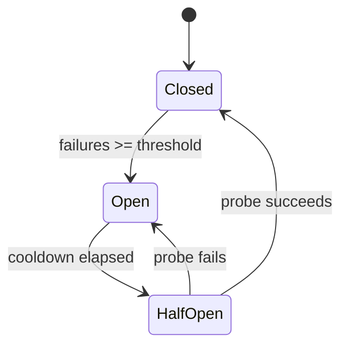

```typescript
// packages/orchestration/src/circuit-breaker.ts

type CircuitState = 'closed' | 'open' | 'half-open';

interface CircuitBreakerConfig {
  /** Number of consecutive failures before opening */
  failureThreshold: number;
  /** Milliseconds to wait before probing in half-open state */
  cooldownMs: number;
  /** Number of successful probes to close the circuit */
  successThreshold: number;
  /** Timeout for individual operations */
  operationTimeoutMs: number;
}

interface CircuitBreaker<T> {
  /** Execute an operation through the breaker */
  execute(operation: () => Promise<T>): Promise<T>;

  /** Get current circuit state */
  getState(): CircuitState;

  /** Get failure count */
  getFailureCount(): number;

  /** Manually reset the breaker to closed */
  reset(): void;

  /** Register a listener for state transitions */
  onStateChange(callback: (from: CircuitState, to: CircuitState) => void): void;
}

/** Default thresholds per dependency */
const CIRCUIT_BREAKER_DEFAULTS: Record<string, CircuitBreakerConfig> = {
  ollama: {
    failureThreshold: 3,
    cooldownMs: 30_000,
    successThreshold: 2,
    operationTimeoutMs: 30_000,
  },
  minecraft: {
    failureThreshold: 5,
    cooldownMs: 10_000,
    successThreshold: 1,
    operationTimeoutMs: 15_000,
  },
  sqlite: {
    failureThreshold: 3,
    cooldownMs: 5_000,
    successThreshold: 1,
    operationTimeoutMs: 5_000,
  },
};
```

### Recovery State Machine

Tracks overall system health and coordinates recovery actions when components fail.

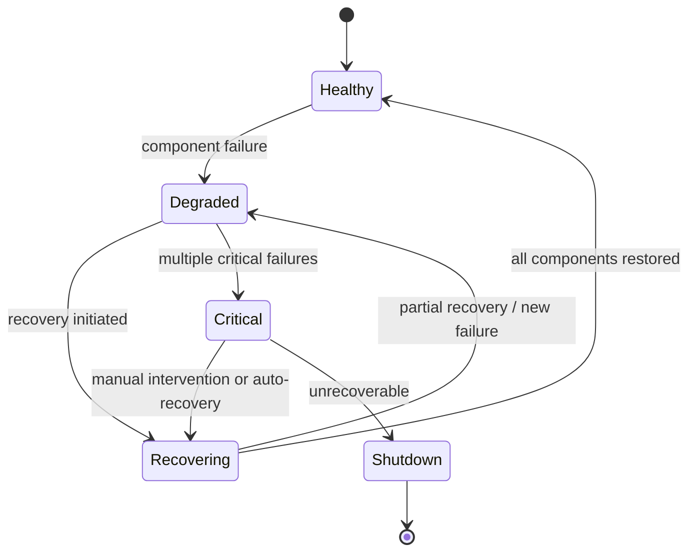

```typescript
// packages/orchestration/src/recovery.ts

type SystemHealthState = 'healthy' | 'degraded' | 'recovering' | 'critical' | 'shutdown';

interface ComponentFailure {
  component: string;
  error: Error;
  timestamp: Date;
  retryCount: number;
}

interface RecoveryManager {
  /** Get current system health state */
  getState(): SystemHealthState;

  /** Report a component failure */
  reportFailure(component: string, error: Error): void;

  /** Report a component recovery */
  reportRecovery(component: string): void;

  /** Attempt recovery of a specific component */
  attemptRecovery(component: string): Promise<boolean>;

  /** Get all active failures */
  getActiveFailures(): ComponentFailure[];

  /** Register recovery strategy for a component */
  registerStrategy(component: string, strategy: RecoveryStrategy): void;

  /** Initiate graceful shutdown */
  initiateShutdown(): Promise<void>;
}

interface RecoveryStrategy {
  /** Max retry attempts before escalating */
  maxRetries: number;
  /** Backoff base in ms */
  backoffBaseMs: number;
  /** Recovery action */
  recover(failure: ComponentFailure): Promise<boolean>;
}
```

### Graceful Shutdown Flow

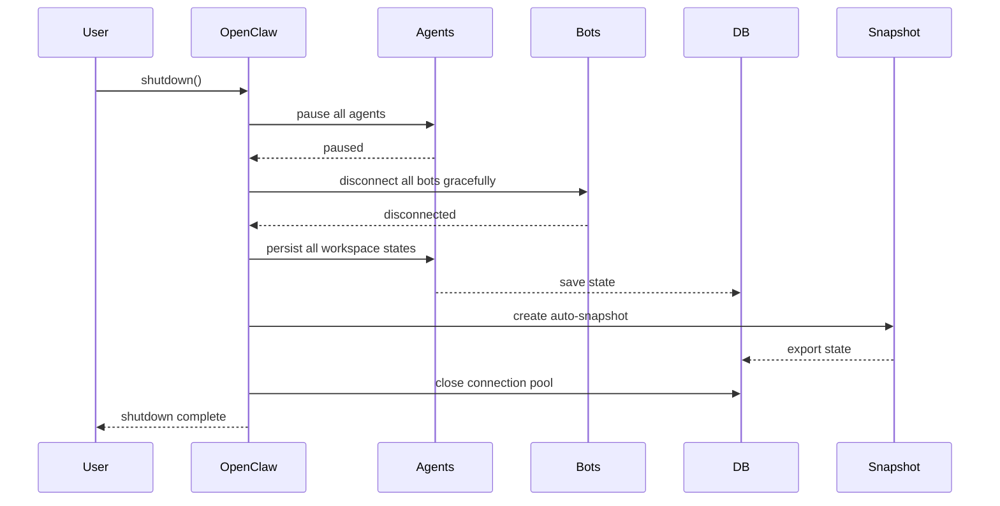


---

## Performance and Scalability Design

*Addresses: Requirement 25*

### Caching Strategy

A two-tier cache (in-memory LRU + optional disk) for frequently accessed read-heavy data.

```typescript
// packages/shared-types/src/cache.ts

interface CacheConfig {
  /** Max items in LRU cache */
  maxSize: number;
  /** Time-to-live in milliseconds (0 = no expiry) */
  ttlMs: number;
  /** Whether to write-through to SQLite on set */
  writeThrough: boolean;
}

interface Cache<T> {
  get(key: string): T | undefined;
  set(key: string, value: T): void;
  invalidate(key: string): void;
  invalidatePattern(pattern: RegExp): void;
  clear(): void;
  stats(): CacheStats;
}

interface CacheStats {
  hits: number;
  misses: number;
  size: number;
  hitRate: number;
}

/** Cache configuration per data type */
const CACHE_CONFIGS: Record<string, CacheConfig> = {
  blueprints: {
    maxSize: 50,
    ttlMs: 300_000,       // 5 minutes — blueprints change rarely
    writeThrough: false,
  },
  agentStates: {
    maxSize: 100,
    ttlMs: 10_000,        // 10 seconds — agent states change frequently
    writeThrough: true,
  },
  resourceLevels: {
    maxSize: 200,
    ttlMs: 5_000,         // 5 seconds — resources update often
    writeThrough: true,
  },
  pathCache: {
    maxSize: 500,
    ttlMs: 60_000,        // 1 minute — paths invalidated on world changes
    writeThrough: false,
  },
  configValues: {
    maxSize: 50,
    ttlMs: 0,             // no expiry — invalidated on config reload
    writeThrough: false,
  },
};
```

**Cache Invalidation Rules:**
- Blueprint cache: invalidated on blueprint update/delete, version change
- Agent state cache: invalidated on agent state transition, write-through on every set
- Resource cache: invalidated on resource transaction, write-through on every set
- Path cache: invalidated on world block change within cached path region
- Config cache: invalidated on config file reload

### Connection Pooling

```typescript
// packages/data-layer/src/database.ts (extended)

interface ConnectionPoolConfig {
  /** Max connections in pool */
  maxConnections: number;
  /** Min idle connections to maintain */
  minIdle: number;
  /** Max time to wait for a connection (ms) */
  acquireTimeoutMs: number;
  /** Max time a connection can be idle before eviction (ms) */
  idleTimeoutMs: number;
}

interface ConnectionPool {
  /** Acquire a connection from the pool */
  acquire(): Promise<DatabaseConnection>;
  /** Release a connection back to the pool */
  release(connection: DatabaseConnection): void;
  /** Get pool statistics */
  stats(): PoolStats;
  /** Drain and close all connections */
  drain(): Promise<void>;
}

interface PoolStats {
  total: number;
  active: number;
  idle: number;
  waiting: number;
}

const POOL_DEFAULTS = {
  sqlite: {
    maxConnections: 5,
    minIdle: 1,
    acquireTimeoutMs: 3_000,
    idleTimeoutMs: 60_000,
  },
  ollama: {
    maxConnections: 4,    // matches max_concurrent_requests config
    minIdle: 1,
    acquireTimeoutMs: 5_000,
    idleTimeoutMs: 30_000,
  },
};
```

### Throttling Design

When system load exceeds capacity, the task assignment pipeline applies backpressure.

```typescript
// packages/society-engine/src/throttle.ts

interface ThrottleConfig {
  /** Max task assignments per second */
  maxAssignmentsPerSecond: number;
  /** Queue depth at which throttling begins */
  queueDepthThreshold: number;
  /** Max pending assignments before rejecting */
  maxPendingAssignments: number;
}

interface TaskThrottle {
  /** Check if a new assignment is allowed */
  canAssign(): boolean;
  /** Record an assignment */
  recordAssignment(): void;
  /** Get current load metrics */
  getLoad(): ThrottleMetrics;
}

interface ThrottleMetrics {
  assignmentsPerSecond: number;
  pendingAssignments: number;
  queueDepth: number;
  throttled: boolean;
}

const THROTTLE_DEFAULTS: ThrottleConfig = {
  maxAssignmentsPerSecond: 50,
  queueDepthThreshold: 200,
  maxPendingAssignments: 500,
};
```

### Memory Budget Allocation

Target: under 2GB total for typical workloads (20 workers, 50 bots).

| Component | Budget | Notes |
|---|---|---|
| Node.js baseline | ~100 MB | V8 heap overhead |
| Agent workspaces (20) | ~200 MB | ~10 MB per agent context |
| Bot instances (50) | ~250 MB | ~5 MB per Mineflayer bot |
| SQLite connection pool | ~50 MB | 5 connections, shared cache |
| LRU caches | ~100 MB | Blueprints, paths, states |
| Ollama request buffers | ~100 MB | 4 concurrent requests |
| WebSocket buffers | ~50 MB | Event batching, client state |
| Log buffers | ~20 MB | In-memory before flush |
| Task queues | ~30 MB | Pending + in-progress tasks |
| Headroom | ~100 MB | GC overhead, spikes |
| **Total** | **~1,000 MB** | Well under 2 GB limit |


---

## Plugin and Extensibility System

*Addresses: Requirement 26*

### Plugin Architecture Overview

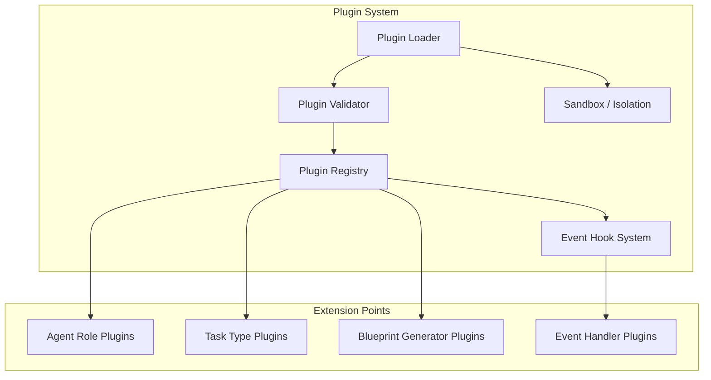

### Plugin Interfaces

```typescript
// packages/shared-types/src/plugin.ts

interface PluginManifest {
  /** Unique plugin identifier */
  id: string;
  /** Semver version */
  version: string;
  /** Display name */
  name: string;
  /** Plugin author */
  author: string;
  /** Minimum PYRAMID OS version required */
  minSystemVersion: string;
  /** What this plugin extends */
  extensionPoints: ExtensionPoint[];
  /** Entry module path */
  entryModule: string;
}

type ExtensionPoint =
  | { type: 'agent-role'; role: string; tier: AgentTier }
  | { type: 'task-type'; taskType: string }
  | { type: 'blueprint-generator'; structureType: string }
  | { type: 'event-handler'; events: string[] };

/** Plugin must implement this interface */
interface Plugin {
  /** Called when plugin is loaded */
  onLoad(context: PluginContext): Promise<void>;
  /** Called when plugin is unloaded */
  onUnload(): Promise<void>;
  /** Health check for the plugin */
  healthCheck(): Promise<boolean>;
}

interface PluginContext {
  /** Logger scoped to this plugin */
  logger: Logger;
  /** Register an agent role implementation */
  registerAgentRole(role: string, factory: AgentFactory): void;
  /** Register a task type handler */
  registerTaskType(taskType: string, handler: TaskHandler): void;
  /** Register a blueprint generator */
  registerBlueprintGenerator(type: string, generator: BlueprintGenerator): void;
  /** Subscribe to system events */
  on(event: SystemEvent, handler: EventHandler): void;
  /** Access read-only system state */
  getSystemState(): Readonly<SystemState>;
}

interface AgentFactory {
  create(config: AgentConfig): Promise<AgentInstance>;
  getPermissions(): ToolName[];
}

interface TaskHandler {
  validate(params: Record<string, unknown>): ValidationResult;
  execute(task: Task, bot: BotInstance): Promise<TaskResult>;
}

type EventHandler = (event: SystemEventPayload) => void | Promise<void>;
```

### Plugin Lifecycle

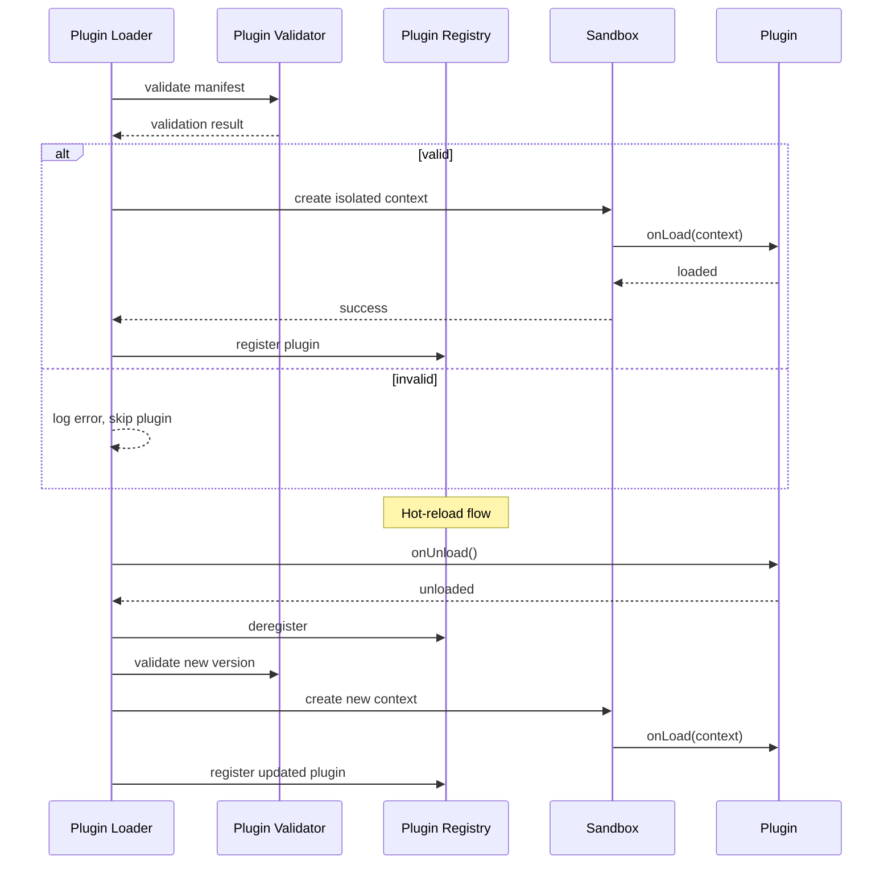

### Plugin Registry

```typescript
// packages/orchestration/src/plugin-registry.ts

interface PluginRegistry {
  /** Register a loaded plugin */
  register(manifest: PluginManifest, instance: Plugin): void;

  /** Deregister a plugin by ID */
  deregister(pluginId: string): void;

  /** Get all registered plugins */
  list(): PluginInfo[];

  /** Get a specific plugin */
  get(pluginId: string): PluginInfo | undefined;

  /** Find plugins by extension point type */
  findByExtensionPoint(type: ExtensionPoint['type']): PluginInfo[];

  /** Check if a plugin is registered */
  has(pluginId: string): boolean;
}

interface PluginInfo {
  manifest: PluginManifest;
  status: 'loaded' | 'error' | 'unloaded';
  loadedAt: Date;
  error?: string;
}
```

### Event Hook System

```typescript
// packages/orchestration/src/event-hooks.ts

type SystemEvent =
  | 'task:created'
  | 'task:assigned'
  | 'task:completed'
  | 'task:failed'
  | 'resource:changed'
  | 'resource:low'
  | 'resource:critical'
  | 'agent:spawned'
  | 'agent:terminated'
  | 'agent:error'
  | 'bot:connected'
  | 'bot:disconnected'
  | 'build:phase-complete'
  | 'ceremony:started'
  | 'ceremony:completed'
  | 'mode:changed'
  | 'health:changed';

interface SystemEventPayload {
  event: SystemEvent;
  timestamp: Date;
  data: Record<string, unknown>;
  civilizationId: string;
}

interface EventHookManager {
  /** Register a handler for an event */
  on(event: SystemEvent, handler: EventHandler, pluginId?: string): void;

  /** Remove a handler */
  off(event: SystemEvent, handler: EventHandler): void;

  /** Remove all handlers for a plugin (used during unload) */
  removeAllForPlugin(pluginId: string): void;

  /** Emit an event to all registered handlers */
  emit(event: SystemEvent, data: Record<string, unknown>): Promise<void>;
}
```

### Plugin Failure Isolation

Plugins run within a try/catch boundary. If a plugin handler throws, the error is logged and the plugin is marked as errored, but the system continues. After 3 consecutive failures, the plugin is automatically unloaded.

```typescript
interface PluginSandbox {
  /** Execute a plugin handler with error isolation */
  execute<T>(pluginId: string, fn: () => Promise<T>): Promise<T | undefined>;

  /** Get failure count for a plugin */
  getFailureCount(pluginId: string): number;

  /** Reset failure count (e.g., after successful execution) */
  resetFailureCount(pluginId: string): void;
}

const PLUGIN_FAILURE_THRESHOLD = 3;
```


---

## CLI Architecture

*Addresses: Requirement 27*

### Command Routing

The CLI uses a command/subcommand pattern routed through a central dispatcher. It connects to the running PYRAMID OS instance via the REST API (no direct module imports), making it a thin client.

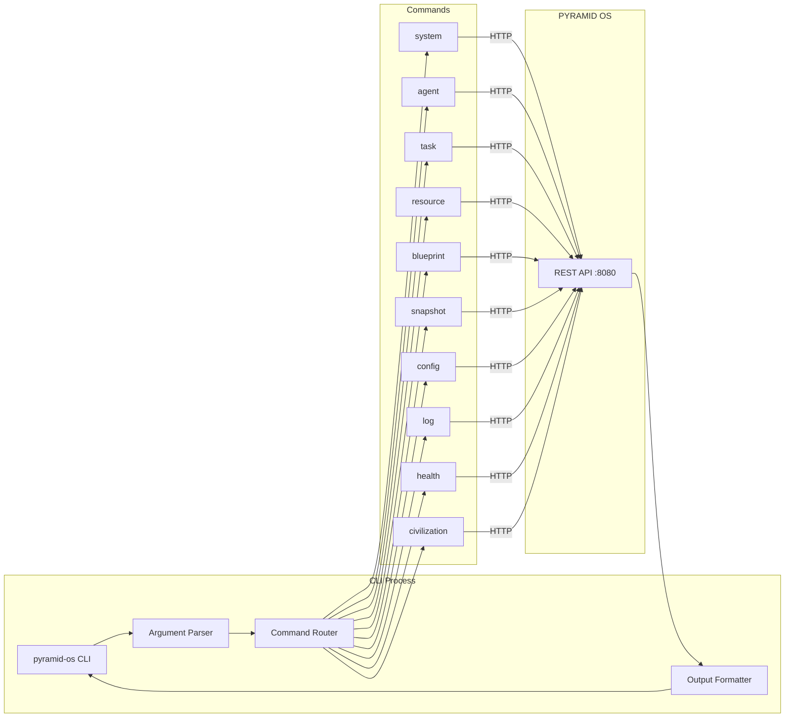

### Command Structure

```typescript
// packages/cli/src/commands/types.ts

interface CliCommand {
  /** Command name (e.g., 'system', 'agent') */
  name: string;
  /** Subcommands */
  subcommands: CliSubcommand[];
  /** Command description for help text */
  description: string;
}

interface CliSubcommand {
  name: string;
  description: string;
  /** Positional arguments */
  args?: CliArg[];
  /** Named options */
  options?: CliOption[];
  /** Handler function */
  handler: (args: ParsedArgs) => Promise<CommandResult>;
}

interface CliArg {
  name: string;
  required: boolean;
  description: string;
}

interface CliOption {
  name: string;
  alias?: string;
  type: 'string' | 'number' | 'boolean';
  description: string;
  default?: unknown;
}

interface CommandResult {
  success: boolean;
  data?: unknown;
  error?: string;
}
```

### Output Formatter

```typescript
// packages/cli/src/formatters.ts

type OutputFormat = 'json' | 'table' | 'text';

interface OutputFormatter {
  /** Format data for display */
  format(data: unknown, format: OutputFormat): string;
}

interface TableFormatter {
  /** Format array of objects as aligned table */
  formatTable(rows: Record<string, unknown>[], columns?: string[]): string;
}

interface JsonFormatter {
  /** Format as pretty-printed JSON */
  formatJson(data: unknown): string;
}

interface TextFormatter {
  /** Format as human-readable plain text */
  formatText(data: unknown, template?: string): string;
}

// The --format flag is global and defaults to 'table'
// JSON format is useful for piping to jq or other tools
// Text format is minimal, one-value-per-line for scripting
```

### API Client

The CLI uses a lightweight HTTP client to communicate with the REST API.

```typescript
// packages/cli/src/api-client.ts

interface CliApiClient {
  /** Base URL of the PYRAMID OS API */
  baseUrl: string;
  /** API key for authentication */
  apiKey: string;

  get<T>(path: string, params?: Record<string, string>): Promise<T>;
  post<T>(path: string, body?: unknown): Promise<T>;

  /** Check if the API is reachable */
  ping(): Promise<boolean>;
}

// Reads baseUrl and apiKey from:
// 1. CLI flags (--api-url, --api-key)
// 2. Environment variables (PYRAMID_API_URL, PYRAMID_API_KEY)
// 3. Config file (config/default.yaml → api.port)
```


---

## GitHub/CI Readiness

*Addresses: Requirement 30*

### CI/CD Pipeline Design (GitHub Actions)

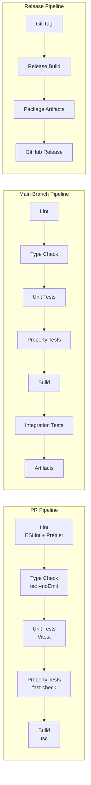

### GitHub Actions Workflow Stages

```yaml
# .github/workflows/ci.yml
name: CI
on:
  push:
    branches: [main]
  pull_request:
    branches: [main]

jobs:
  lint:
    runs-on: windows-latest
    steps:
      - uses: actions/checkout@v4
      - uses: pnpm/action-setup@v4
      - uses: actions/setup-node@v4
        with:
          node-version: '22'
          cache: 'pnpm'
      - run: pnpm install --frozen-lockfile
      - run: pnpm run lint
      - run: pnpm run format:check

  typecheck:
    runs-on: windows-latest
    needs: lint
    steps:
      - uses: actions/checkout@v4
      - uses: pnpm/action-setup@v4
      - uses: actions/setup-node@v4
        with:
          node-version: '22'
          cache: 'pnpm'
      - run: pnpm install --frozen-lockfile
      - run: pnpm run typecheck

  test:
    runs-on: windows-latest
    needs: typecheck
    steps:
      - uses: actions/checkout@v4
      - uses: pnpm/action-setup@v4
      - uses: actions/setup-node@v4
        with:
          node-version: '22'
          cache: 'pnpm'
      - run: pnpm install --frozen-lockfile
      - run: pnpm run test -- --run
      - run: pnpm run test:property -- --run

  build:
    runs-on: windows-latest
    needs: test
    steps:
      - uses: actions/checkout@v4
      - uses: pnpm/action-setup@v4
      - uses: actions/setup-node@v4
        with:
          node-version: '22'
          cache: 'pnpm'
      - run: pnpm install --frozen-lockfile
      - run: pnpm run build
      - uses: actions/upload-artifact@v4
        with:
          name: pyramid-os-build
          path: packages/*/dist/
```

### Release Process

1. Version bump via `pnpm version` in root (updates all packages)
2. Git tag `vX.Y.Z` triggers release pipeline
3. Release pipeline builds all packages, runs full test suite
4. Artifacts uploaded to GitHub Release with changelog

### Artifact Structure

```
pyramid-os-vX.Y.Z/
├── packages/
│   ├── orchestration/dist/
│   ├── minecraft-controller/dist/
│   ├── society-engine/dist/
│   ├── blueprint/dist/
│   ├── control-centre/dist/
│   ├── shared-types/dist/
│   ├── data-layer/dist/
│   ├── api/dist/
│   ├── cli/dist/
│   └── logger/dist/
├── config/
│   └── default.yaml
├── scripts/
│   ├── install.ps1
│   └── health-check.ps1
└── README.md
```


---

## Error Handling Design

*Addresses: Requirement 38*

### Error Code Taxonomy

Error codes follow the pattern `PYRAMID_{CATEGORY}_{SPECIFIC}` for programmatic handling.

```typescript
// packages/shared-types/src/errors.ts

enum ErrorCategory {
  CONFIG = 'CONFIG',
  CONNECTION = 'CONNECTION',
  AGENT = 'AGENT',
  TASK = 'TASK',
  RESOURCE = 'RESOURCE',
  BLUEPRINT = 'BLUEPRINT',
  DATABASE = 'DATABASE',
  OLLAMA = 'OLLAMA',
  MINECRAFT = 'MINECRAFT',
  PLUGIN = 'PLUGIN',
  SECURITY = 'SECURITY',
  SYSTEM = 'SYSTEM',
}

/** Structured error with code, severity, context, and remediation */
interface PyramidError {
  /** Machine-readable error code */
  code: string;
  /** Error category */
  category: ErrorCategory;
  /** Severity level */
  severity: 'info' | 'warning' | 'error' | 'critical';
  /** Human-readable message with context */
  message: string;
  /** Suggested remediation steps */
  remediation?: string[];
  /** Link to troubleshooting docs */
  docsUrl?: string;
  /** Additional context (config field, component name, etc.) */
  context?: Record<string, unknown>;
  /** Original error if wrapping */
  cause?: Error;
  /** Timestamp */
  timestamp: Date;
}

/** Error code registry — maps codes to default messages and remediations */
const ERROR_REGISTRY: Record<string, { message: string; remediation?: string[]; docsUrl?: string }> = {
  // Config errors
  PYRAMID_CONFIG_INVALID_FIELD: {
    message: 'Configuration field is invalid',
    remediation: ['Check the field value in config/default.yaml', 'Run: pyramid-os config validate'],
  },
  PYRAMID_CONFIG_MISSING_FILE: {
    message: 'Configuration file not found',
    remediation: ['Create config/default.yaml from the example', 'Run: pyramid-os config validate'],
  },

  // Connection errors
  PYRAMID_CONNECTION_NETWORK: {
    message: 'Network connection failed',
    remediation: ['Check that the target host is reachable', 'Verify firewall settings'],
  },
  PYRAMID_CONNECTION_AUTH: {
    message: 'Authentication failed',
    remediation: ['Verify credentials in configuration', 'Check account permissions'],
  },
  PYRAMID_CONNECTION_SERVER: {
    message: 'Server rejected the connection',
    remediation: ['Verify server version compatibility', 'Check server whitelist settings'],
  },

  // Ollama errors
  PYRAMID_OLLAMA_UNAVAILABLE: {
    message: 'Ollama service is not reachable',
    remediation: ['Start Ollama: ollama serve', 'Check Ollama host/port in config'],
  },
  PYRAMID_OLLAMA_MODEL_MISSING: {
    message: 'Required Ollama model is not installed',
    remediation: ['Install the model: ollama pull <model_name>'],
  },
  PYRAMID_OLLAMA_TIMEOUT: {
    message: 'Ollama request timed out',
    remediation: ['Check Ollama resource usage', 'Increase timeout in config'],
  },

  // Database errors
  PYRAMID_DATABASE_LOCKED: {
    message: 'Database is locked by another process',
    remediation: ['Check for other PYRAMID OS instances', 'Restart the system'],
  },
  PYRAMID_DATABASE_INTEGRITY: {
    message: 'Database integrity check failed',
    remediation: ['Restore from backup: pyramid-os snapshot restore', 'Run integrity repair'],
  },

  // Agent errors
  PYRAMID_AGENT_PERMISSION: {
    message: 'Agent attempted an action outside its permissions',
    remediation: ['Review agent role configuration', 'Check workspace tool permissions'],
  },

  // Plugin errors
  PYRAMID_PLUGIN_INCOMPATIBLE: {
    message: 'Plugin is incompatible with current system version',
    remediation: ['Update the plugin to a compatible version', 'Check plugin manifest minSystemVersion'],
  },
  PYRAMID_PLUGIN_LOAD_FAILED: {
    message: 'Plugin failed to load',
    remediation: ['Check plugin entry module path', 'Review plugin logs for details'],
  },

  // Security errors
  PYRAMID_SECURITY_BOUNDARY: {
    message: 'Safety boundary violation detected',
    remediation: ['Review agent behavior logs', 'Adjust safety constraints if appropriate'],
  },
};
```

### Error Aggregation

Prevents log spam when the same error occurs repeatedly (e.g., Ollama connection retries).

```typescript
// packages/logger/src/error-aggregator.ts

interface ErrorAggregator {
  /** Report an error — may aggregate with recent identical errors */
  report(error: PyramidError): void;

  /** Flush aggregated errors to the log */
  flush(): void;
}

interface AggregatedError {
  error: PyramidError;
  count: number;
  firstSeen: Date;
  lastSeen: Date;
}

interface AggregatorConfig {
  /** Time window for aggregation (ms) */
  windowMs: number;
  /** Max unique errors to track before flushing */
  maxTracked: number;
}

const AGGREGATOR_DEFAULTS: AggregatorConfig = {
  windowMs: 10_000,     // 10-second window
  maxTracked: 100,
};

// Errors are keyed by code + context hash
// After the window expires, a single log entry is emitted:
//   "PYRAMID_OLLAMA_UNAVAILABLE occurred 15 times in the last 10s"
```

### Remediation Suggestion System

When an error is created, the system looks up its code in the `ERROR_REGISTRY` and attaches remediation steps and docs links automatically. For config errors, the specific invalid field path is included in `context.fieldPath`. For dependency errors, install commands are included in `remediation`.


---

## Graceful Degradation Design

*Addresses: Requirement 40*

### Degradation State Machine

The system tracks the health of each major component independently and computes an overall degradation level.

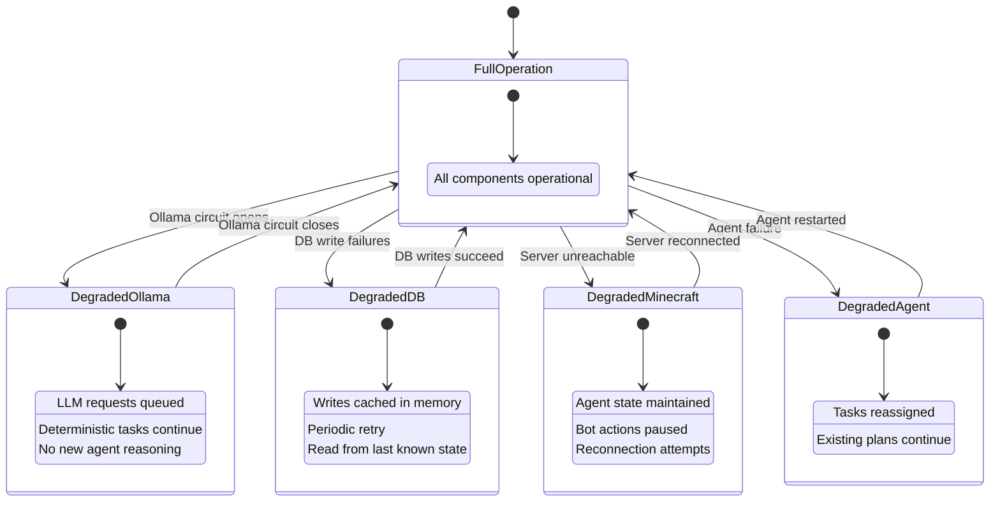

### Component Failure Fallback Specifications

```typescript
// packages/orchestration/src/degradation.ts

interface DegradationManager {
  /** Get current degradation state per component */
  getComponentStates(): Map<string, ComponentDegradationState>;

  /** Get overall system degradation level */
  getOverallLevel(): DegradationLevel;

  /** Register a component with its fallback behavior */
  registerComponent(component: string, fallback: FallbackSpec): void;

  /** Notify that a component has failed */
  notifyFailure(component: string): void;

  /** Notify that a component has recovered */
  notifyRecovery(component: string): void;
}

type DegradationLevel = 'full' | 'degraded' | 'critical' | 'minimal';

interface ComponentDegradationState {
  component: string;
  healthy: boolean;
  failedSince?: Date;
  fallbackActive: boolean;
}

interface FallbackSpec {
  component: string;
  /** What to do when this component fails */
  onFailure: () => Promise<void>;
  /** What to do when this component recovers */
  onRecovery: () => Promise<void>;
  /** Priority during degraded operation (lower = higher priority) */
  priority: number;
}
```

### Fallback Behavior Per Component

| Component | Failure Mode | Fallback Behavior | Priority |
|---|---|---|---|
| Ollama | Unavailable / timeout | Queue LLM requests; continue deterministic worker tasks; no new agent reasoning | 2 |
| SQLite | Write failures / locked | Cache writes in memory Map; retry every 5s; reads serve from cache or last known state | 1 (critical) |
| Minecraft Server | Unreachable / disconnect | Preserve all agent state; pause bot actions; attempt reconnection with exponential backoff | 3 |
| Planner Agent | Crash / unresponsive | Continue executing existing plans; operational agents work from last directives | 4 |
| Operational Agent | Crash / unresponsive | Redistribute responsibilities to other operational agents of same or similar role | 3 |
| Worker Agent | Crash / unresponsive | Reassign tasks to other available workers; restart agent | 5 |
| Control Centre | Disconnected | No impact on agent operations; events buffered for reconnection | 6 (lowest) |

### Critical Operation Prioritization

During degraded operation, the system prioritizes operations in this order:
1. **Safety enforcement** — boundary checks always active
2. **Data persistence** — flush memory cache to DB when possible
3. **Health monitoring** — continue health checks to detect recovery
4. **Active task completion** — finish in-progress tasks
5. **New task assignment** — throttled or paused depending on degradation level
6. **UI updates** — lowest priority, buffered


---

## Platform Compatibility Design

*Addresses: Requirement 42*

### Cross-Platform Path Handling

All file path operations use Node.js `path` module to ensure correct separators on any OS. No hardcoded `/` or `\` in path construction.

```typescript
// packages/shared-types/src/paths.ts

import path from 'node:path';

interface PathResolver {
  /** Resolve a workspace-relative path to absolute */
  resolve(...segments: string[]): string;

  /** Get the data directory */
  dataDir(): string;

  /** Get the snapshots directory */
  snapshotsDir(): string;

  /** Get the logs directory */
  logsDir(): string;

  /** Get the database file path */
  databasePath(): string;

  /** Normalize a user-provided path (handles drive letters, mixed separators) */
  normalize(userPath: string): string;
}

/** Implementation uses path.join / path.resolve exclusively */
class CrossPlatformPathResolver implements PathResolver {
  constructor(private workspaceRoot: string) {}

  resolve(...segments: string[]): string {
    return path.resolve(this.workspaceRoot, ...segments);
  }

  dataDir(): string {
    return this.resolve('data');
  }

  snapshotsDir(): string {
    return this.resolve('data', 'snapshots');
  }

  logsDir(): string {
    return this.resolve('logs');
  }

  databasePath(): string {
    return this.resolve('data', 'pyramid.db');
  }

  normalize(userPath: string): string {
    // Handles: C:\Users\foo\bar, /home/foo/bar, mixed C:/Users\foo
    return path.normalize(userPath);
  }
}
```

### Windows-Specific Considerations

| Concern | Handling |
|---|---|
| Path separators | `path.join()` / `path.resolve()` everywhere — never string concatenation |
| Drive letters | `path.normalize()` handles `C:\` and `C:/` forms |
| File locking | SQLite uses WAL mode; retry with backoff on `SQLITE_BUSY` |
| Long paths | Enable long path support via Node.js `--experimental-vm-modules` if needed; keep paths under 260 chars by default |
| Line endings | `.gitattributes` with `* text=auto` for consistent line endings |
| PowerShell scripts | All automation scripts are `.ps1`; no bash dependency |
| Temp files | Use `os.tmpdir()` for temporary files, never hardcoded `/tmp` |
| Process signals | `SIGINT`/`SIGTERM` handling works on Windows via Node.js; `SIGKILL` not trappable |
| File watching | Use `fs.watch` with `recursive: true` (supported on Windows since Node 19) |


---

## Development Workflow Design

*Addresses: Requirement 44*

### Hot-Reload Design

The Control Centre uses file watching during development to rebuild and reload on changes.

```typescript
// Development mode only — not used in production

interface HotReloadConfig {
  /** Directories to watch */
  watchPaths: string[];
  /** File extensions to trigger reload */
  extensions: string[];
  /** Debounce delay (ms) */
  debounceMs: number;
}

const DEV_HOT_RELOAD: HotReloadConfig = {
  watchPaths: ['packages/control-centre/src'],
  extensions: ['.ts', '.css', '.html'],
  debounceMs: 300,
};

// Implementation:
// 1. fs.watch on watchPaths with recursive: true
// 2. On change, debounce, then trigger tsc incremental build
// 3. Notify connected Control Centre clients via WebSocket 'reload' event
// 4. Client reloads the page
```

### Mock System Architecture

Mock implementations share the same interfaces as real dependencies, allowing any component to run in isolation during development.

```typescript
// packages/shared-types/src/mocks.ts

/** Mock Ollama that returns canned responses */
interface MockOllamaConfig {
  /** Fixed response for each model */
  responses: Record<string, string>;
  /** Simulated latency (ms) */
  latencyMs: number;
  /** Whether to simulate failures */
  simulateFailures: boolean;
  /** Failure rate (0-1) when simulateFailures is true */
  failureRate: number;
}

/** Mock Minecraft server that simulates bot actions */
interface MockMinecraftConfig {
  /** World seed for deterministic terrain */
  worldSeed: number;
  /** Simulated tick rate */
  tickRateMs: number;
  /** Whether bots can "see" each other */
  multiBot: boolean;
}

/** Mock database that stores in memory */
// Uses Map<string, unknown> internally, implements same repository interfaces
// Useful for unit tests and isolated component development
```

### Seed Data Strategy

Seed data provides pre-configured scenarios for testing and development.

```typescript
// packages/data-layer/src/seeds/types.ts

interface SeedScenario {
  /** Scenario name */
  name: string;
  /** Description of what this scenario sets up */
  description: string;
  /** Civilization config */
  civilization: CivilizationSeed;
  /** Pre-spawned agents */
  agents: AgentSeed[];
  /** Pre-loaded blueprints */
  blueprints: BlueprintSeed[];
  /** Initial resource inventory */
  resources: ResourceSeed[];
  /** Pre-defined zones */
  zones: ZoneSeed[];
  /** Pre-created tasks */
  tasks: TaskSeed[];
}

// Available seed scenarios:
// 1. "empty"        — Fresh civilization, no agents or tasks
// 2. "basic"        — 1 of each agent role, basic resources, empty task queue
// 3. "mid-build"    — Pyramid 40% complete, active workers, resource procurement in progress
// 4. "low-resources" — Critical resource levels, procurement tasks pending
// 5. "full-society"  — All agents active, multiple districts, ceremonies scheduled
// 6. "failure-mode"  — Simulates component failures for testing recovery

// Usage: pyramid-os seed load <scenario-name>
```

### Development Scripts

```json
{
  "scripts": {
    "dev": "tsc --build --watch",
    "dev:api": "tsx watch packages/api/src/server.ts",
    "dev:control-centre": "tsx watch packages/control-centre/src/app.ts",
    "dev:mock-minecraft": "tsx packages/minecraft-controller/src/__mocks__/server.ts",
    "dev:mock-ollama": "tsx packages/orchestration/src/__mocks__/ollama.ts",
    "seed": "tsx packages/data-layer/src/seeds/loader.ts",
    "test": "vitest",
    "test:property": "vitest --run --config vitest.property.config.ts",
    "build": "tsc --build",
    "lint": "eslint packages/*/src/**/*.ts",
    "format": "prettier --write packages/*/src/**/*.ts",
    "format:check": "prettier --check packages/*/src/**/*.ts",
    "typecheck": "tsc --noEmit"
  }
}
```


---

## Correctness Properties

*A property is a characteristic or behavior that should hold true across all valid executions of a system — essentially, a formal statement about what the system should do. Properties serve as the bridge between human-readable specifications and machine-verifiable correctness guarantees.*

The following properties cover the newly added requirement areas (13, 25, 26, 27, 38, 40, 42, 44). Properties for the original design sections (blueprint round-trip, snapshot round-trip, etc.) are defined in the existing testing strategy and remain unchanged.

### Property 1: Circuit breaker state transitions

*For any* sequence of operation results (success/failure) applied to a circuit breaker, the breaker state should transition correctly: it opens after `failureThreshold` consecutive failures, transitions to half-open after `cooldownMs`, and closes after `successThreshold` consecutive successes in half-open state. At no point should the breaker be in an invalid state.

**Validates: Requirements 13.8**

### Property 2: Graceful shutdown persists all state

*For any* system state with active agents and pending tasks, initiating graceful shutdown should result in all agent workspace states being persisted to the database, such that restoring from the database yields equivalent agent states.

**Validates: Requirements 13.10**

### Property 3: Task failure escalation to blocked

*For any* task that fails `max_retries` times consecutively, the task status should transition to `blocked`, and all tasks that depend on it should also be marked `blocked`.

**Validates: Requirements 13.5**

### Property 4: Worker failure task reassignment

*For any* worker agent with assigned tasks, if the agent fails, all its assigned tasks should be reassigned to other available worker agents of compatible role, and no task should be lost.

**Validates: Requirements 13.1, 40.5**

### Property 5: Cache consistency on invalidation

*For any* cached item, after the item is updated in the underlying store and the cache is invalidated, subsequent cache reads should return the updated value (not stale data).

**Validates: Requirements 25.9**

### Property 6: Connection pool bounds

*For any* sequence of acquire/release operations on a connection pool, the number of active connections should never exceed `maxConnections`, and the number of idle connections should never drop below `minIdle` (when total connections >= minIdle).

**Validates: Requirements 25.8**

### Property 7: Throttle respects rate limit

*For any* sequence of task assignment attempts, when the assignment rate exceeds `maxAssignmentsPerSecond`, the throttle should reject excess assignments, and the actual throughput should not exceed the configured limit.

**Validates: Requirements 25.10**

### Property 8: Plugin failure isolation

*For any* loaded plugin that throws an error during event handling, the main system should continue operating, the error should be logged, and other plugins should not be affected.

**Validates: Requirements 26.8**

### Property 9: Plugin registry consistency

*For any* plugin that is loaded and registered, the registry should list it. For any plugin that is unloaded, the registry should not list it. The registry count should always equal the number of successfully loaded plugins.

**Validates: Requirements 26.10**

### Property 10: Plugin validation rejects incompatible plugins

*For any* plugin manifest where `minSystemVersion` is greater than the current system version, loading should fail with a `PYRAMID_PLUGIN_INCOMPATIBLE` error and the plugin should not appear in the registry.

**Validates: Requirements 26.7**

### Property 11: Event hooks fire for all subscribers

*For any* system event with N registered handlers, emitting that event should invoke all N handlers exactly once each.

**Validates: Requirements 26.5**

### Property 12: CLI output format validity

*For any* command result formatted as JSON, the output should be valid parseable JSON. For any command result formatted as table, the output should contain aligned column headers matching the data keys.

**Validates: Requirements 27.10**

### Property 13: CLI help text completeness

*For any* registered CLI command, requesting help should produce non-empty text containing the command name and description.

**Validates: Requirements 27.11**

### Property 14: Error structure completeness

*For any* error produced by the system, it should have a non-empty error code matching the `PYRAMID_{CATEGORY}_{SPECIFIC}` pattern, a valid severity level, and a non-empty human-readable message.

**Validates: Requirements 38.1, 38.6, 38.7**

### Property 15: Error aggregation prevents spam

*For any* sequence of N identical errors (same code + context) occurring within the aggregation window, the logger should emit at most 1 log entry (with count = N) rather than N separate entries.

**Validates: Requirements 38.9**

### Property 16: Connection error classification

*For any* connection failure, the error category should correctly distinguish between network errors (`PYRAMID_CONNECTION_NETWORK`), authentication errors (`PYRAMID_CONNECTION_AUTH`), and server errors (`PYRAMID_CONNECTION_SERVER`).

**Validates: Requirements 38.5**

### Property 17: Deterministic tasks continue without Ollama

*For any* set of queued deterministic worker tasks (build, mine, haul, patrol), if the Ollama circuit breaker opens, those tasks should continue executing to completion without requiring LLM calls.

**Validates: Requirements 40.1**

### Property 18: Degradation recovery restores full operation

*For any* component that transitions from healthy to failed and back to healthy, the system degradation level should return to its pre-failure state, and all fallback behaviors should be deactivated.

**Validates: Requirements 40.10**

### Property 19: Memory-cached writes survive DB recovery

*For any* set of writes cached in memory during a database failure, when the database recovers, all cached writes should be flushed to the database and the resulting database state should contain all the cached data.

**Validates: Requirements 40.6**

### Property 20: Cross-platform path normalization

*For any* file path containing mixed separators (forward slashes, backslashes) or drive letter prefixes, `normalize()` should produce a valid platform-appropriate path, and `resolve()` should produce an absolute path.

**Validates: Requirements 42.3, 42.4**

### Property 21: Mock interface conformance

*For any* mock implementation (MockOllama, MockMinecraft, MockDatabase), it should implement the same interface as the real dependency, accepting the same inputs and producing outputs of the same type.

**Validates: Requirements 44.4**

### Property 22: Seed data produces valid state

*For any* seed scenario, loading it should produce a system state that passes all validation checks (valid agent roles, valid task statuses, non-negative resource quantities, valid zone bounds).

**Validates: Requirements 44.5**


---

## Extended Error Handling

This section extends the error handling design above with cross-cutting concerns for the newly added components.

### Error Flow Across Components

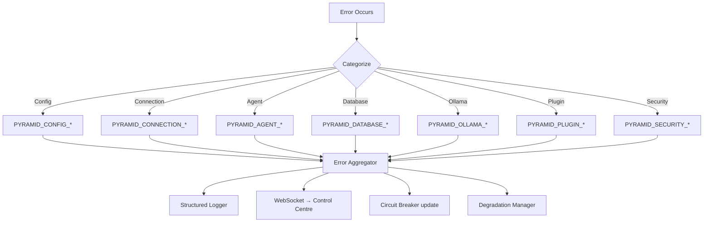

All errors flow through the aggregator before reaching the logger, WebSocket, and degradation manager. This ensures consistent handling regardless of where the error originates.

---

## Extended Testing Strategy

This section covers the testing approach for the newly added design sections. It complements the existing testing strategy for core components.

### Property-Based Testing

**Library:** [fast-check](https://github.com/dubzzz/fast-check) for TypeScript property-based testing.

**Configuration:** Each property test runs a minimum of 100 iterations. Each test is tagged with a comment referencing its design property.

### Property Test Mapping

| Property | Test Target | Generator Strategy |
|---|---|---|
| 1: Circuit breaker transitions | `CircuitBreaker` | Generate random sequences of success/failure results |
| 2: Graceful shutdown persistence | `RecoveryManager` + `AgentManager` | Generate random agent states and workspace contexts |
| 3: Task failure escalation | `TaskQueue` + `DependencyGraph` | Generate random task graphs with failure sequences |
| 4: Worker failure reassignment | `AgentManager` + `TaskQueue` | Generate random worker pools and task assignments |
| 5: Cache consistency | `Cache` | Generate random get/set/invalidate sequences |
| 6: Connection pool bounds | `ConnectionPool` | Generate random acquire/release sequences with timing |
| 7: Throttle rate limit | `TaskThrottle` | Generate random assignment bursts at varying rates |
| 8: Plugin failure isolation | `PluginSandbox` | Generate plugins that throw random errors |
| 9: Plugin registry consistency | `PluginRegistry` | Generate random load/unload sequences |
| 10: Plugin validation | `PluginValidator` | Generate random manifests with varying version constraints |
| 11: Event hooks fire | `EventHookManager` | Generate random event subscriptions and emissions |
| 12: CLI output format | `OutputFormatter` | Generate random command results, format as JSON/table |
| 13: CLI help text | `CliCommand` registry | Enumerate all registered commands |
| 14: Error structure | `PyramidError` factory | Generate random error codes and contexts |
| 15: Error aggregation | `ErrorAggregator` | Generate sequences of identical and distinct errors |
| 16: Connection error classification | `ServerConnector` | Generate different failure types (timeout, 401, ECONNREFUSED) |
| 17: Deterministic tasks without Ollama | `SocietyEngine` + `CircuitBreaker` | Generate deterministic task queues, simulate Ollama failure |
| 18: Degradation recovery | `DegradationManager` | Generate failure/recovery sequences for each component |
| 19: Memory-cached writes | `DatabaseManager` fallback | Generate random writes, simulate DB failure and recovery |
| 20: Path normalization | `CrossPlatformPathResolver` | Generate paths with mixed separators, drive letters, relative segments |
| 21: Mock interface conformance | Mock implementations | Generate random inputs, verify output types match real interface |
| 22: Seed data validity | `SeedScenario` loader | Load each seed scenario, run validation checks |

### Unit Test Focus Areas

Unit tests complement property tests by covering specific examples and edge cases:

- Circuit breaker: exact threshold boundary (e.g., exactly `failureThreshold` failures)
- Graceful shutdown: shutdown during active task execution
- Error codes: verify each code in `ERROR_REGISTRY` has a valid format
- Plugin lifecycle: load → error → unload → reload sequence
- CLI: specific command output for known inputs
- Path handling: Windows UNC paths (`\\server\share`), paths with spaces
- Seed data: each named scenario loads without errors

### Integration Test Focus Areas

- Circuit breaker + Degradation Manager: verify that circuit breaker state changes trigger correct degradation transitions
- Plugin system + Event hooks: verify plugins receive events after registration
- CLI + REST API: verify CLI commands produce correct API calls and format responses
- Error aggregation + WebSocket: verify aggregated errors are pushed to Control Centre
- Graceful shutdown end-to-end: start system, create state, shutdown, restart, verify state restored

### Test Tag Format

Each property-based test must include a comment tag:

```typescript
// Feature: pyramid-os, Property 1: Circuit breaker state transitions
// Feature: pyramid-os, Property 14: Error structure completeness
```
